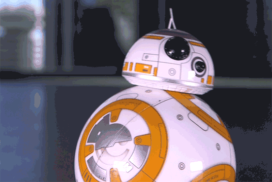
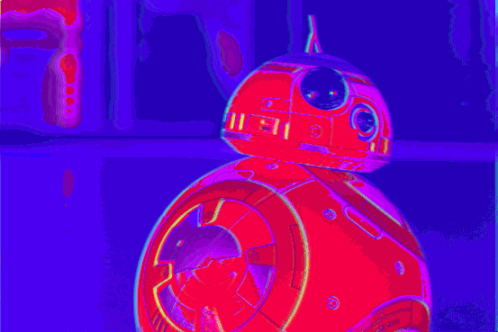

# color_shuffle
Shuffles colors in gifs and outputs the recolored gif- this is a lot like [Pixelsnort](https://github.com/wizzah/pixelsnort) but in python and using gifs.

## input

 I found this bb-8 through google images

## output

 I promise you can make it look way cooler!

## file directory
make a folder where your gif frames are gonna go while they get processed. Change your directory in your settings to reflect whatever you call the folder.

## virtual environment
use a python virtual environment and install the requirements:

`pip install -r requirements.txt`

**note**: currently, there is some kind of bug with imageio reading in gif files. [This commit fixes it.](https://github.com/imageio/imageio/commit/7fa24ae6d4d99da669152ef5edcdefc295d6cc01)
you can use pip to install that specific commit, I believe this is it:
`pip install git+git://github.com/imageio/imageio.git@7fa24ae6d4d99da669152ef5edcdefc295d6cc01`

## directions
- Alright, so run `python extract_gif.py` to split the gif by frames and save them (I found most of this code elsewhere)
- then `python process.py` to apply any cool color changes
- `python stitch.py` to put humpty dumpty back together again
- if you make something really cool, let me know

## fun thing to note
I don't have any code that clears out the output folder. If you extract a gif with lots of frames, and then one with a few frames, it isn't going to delete the leftover frames.
